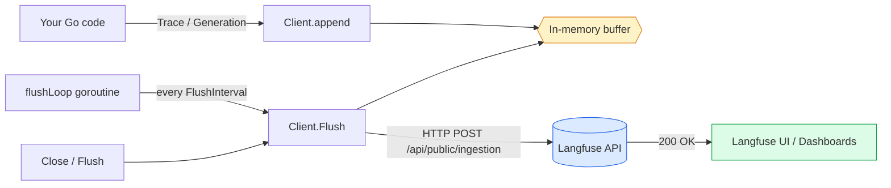
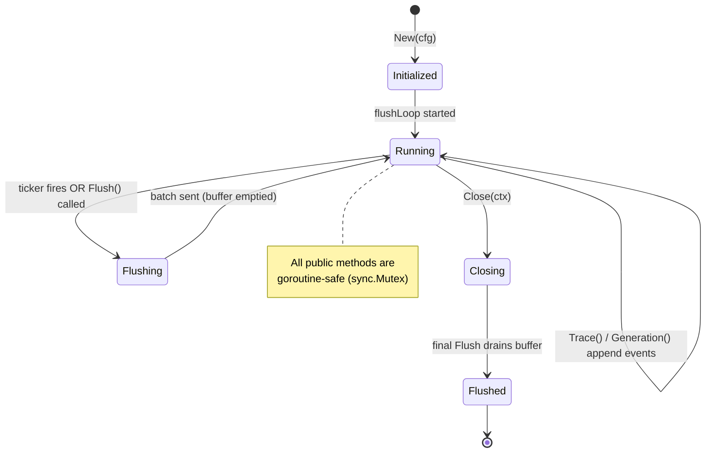

# langfuse-go

[](https://pkg.go.dev/github.com/numoru-ia/langfuse-go)
[](LICENSE)
[](https://go.dev)

> **Minimal, zero-dependency Go client for [Langfuse](https://langfuse.com) v3.** A lean ingestion SDK designed for high-throughput LLM observability in production Go services — works with both self-hosted Langfuse and Langfuse Cloud.

Used in production across Numoru open-source projects (`agent-memory-go`, `geo-audit`, `mcp-templates-es`, `mcp-office-assistant`).

---

## Why another Langfuse client?

The official Langfuse SDKs are Python/JS-first. Go teams that need LLM tracing typically hand-roll a client or pull in a heavy OpenTelemetry pipeline. `langfuse-go` sits in between: a single-file client that speaks Langfuse's native ingestion API, batches events in memory, and flushes asynchronously.

| Feature | `langfuse-go` | Official Python SDK | OpenTelemetry → Langfuse | Hand-rolled `http.Client` |
|---|---|---|---|---|
| Native Go | ✅ | ❌ | ✅ | ✅ |
| Zero external deps | ✅ | ❌ | ❌ | ✅ |
| Async batching | ✅ | ✅ | ✅ | ❌ |
| Configurable flush interval | ✅ | ✅ | ✅ | ❌ |
| Built-in LLM semantics (traces / generations / usage) | ✅ | ✅ | ⚠️ via conventions | ❌ |
| Binary size overhead | ~0 KB | n/a | ~2–4 MB | 0 KB |
| Learning curve | Minutes | Hours | Days | Hours |

---

## Install

```bash
go get github.com/numoru-ia/langfuse-go
```

Requires **Go 1.21+**. No third-party dependencies — the package uses only the standard library.

---

## Quick start

```go
package main

import (
    "context"
    "time"

    langfuse "github.com/numoru-ia/langfuse-go"
)

func main() {
    lf := langfuse.New(langfuse.Config{
        BaseURL:       "https://langfuse.numoru.com",
        PublicKey:     "pk-lf-...",
        SecretKey:     "sk-lf-...",
        FlushInterval: 3 * time.Second,
    })
    defer lf.Close(context.Background())

    trace := lf.Trace(&langfuse.TraceInput{
        Name:      "support-agent",
        SessionID: "session-42",
        UserID:    "user-7",
        Metadata:  map[string]any{"tenant_id": "acme"},
        Tags:      []string{"prod", "es-MX"},
    })

    trace.Generation(&langfuse.GenerationInput{
        Name:   "agent-turn",
        Model:  "claude-sonnet-4-6",
        Input:  "What's my outstanding balance?",
        Output: "Your current balance is $1,240 MXN.",
        Usage: &langfuse.Usage{
            InputTokens:  128,
            OutputTokens: 42,
            TotalTokens:  170,
        },
    })
}
```

---

## Architecture

Events are appended to an in-memory buffer and flushed on a timer (or on explicit `Flush` / `Close`). A single background goroutine owns the flush loop; all public methods are safe for concurrent use from multiple goroutines.



### Client lifecycle — state diagram



### Sequence: tracing an LLM call

```mermaid
sequenceDiagram
    autonumber
    participant App as Your Go service
    participant LF as langfuse.Client
    participant Buf as In-memory buffer
    participant Loop as flushLoop()
    participant API as Langfuse API

    App->>LF: lf.Trace(TraceInput{...})
    LF->>Buf: append(trace-create event)
    LF-->>App: *Trace handle

    App->>LF: trace.Generation(GenerationInput{...})
    LF->>Buf: append(generation-create event)

    Note over Loop,Buf: Every FlushInterval (default 3s)
    Loop->>Buf: drain buffer
    Loop->>API: POST /api/public/ingestion<br/>Basic auth (pk:sk)
    API-->>Loop: 2xx / error

    App->>LF: lf.Close(ctx)  // on shutdown
    LF->>Buf: drain remaining events
    LF->>API: final batch POST
    API-->>LF: 2xx
```

---

## API surface

| Type / Function | Purpose |
|---|---|
| `Config` | Base URL, credentials, flush interval, optional `*http.Client` |
| `New(Config) *Client` | Construct the client and start the flush loop |
| `*Client.Trace(*TraceInput) *Trace` | Open a new trace; returns a handle for child events |
| `*Trace.Generation(*GenerationInput)` | Record an LLM call (model, input, output, token usage) under the trace |
| `*Client.Flush(ctx) error` | Synchronously send any buffered events |
| `*Client.Close(ctx) error` | Stop the flush loop and drain the buffer |

### Configuration

| Field | Default | Description |
|---|---|---|
| `BaseURL` | — (required) | e.g. `https://cloud.langfuse.com` or your self-hosted URL |
| `PublicKey` | — (required) | Langfuse project public key (`pk-lf-…`) |
| `SecretKey` | — (required) | Langfuse project secret key (`sk-lf-…`) |
| `FlushInterval` | `3s` | How often the background goroutine flushes |
| `HTTPClient` | `&http.Client{Timeout: 10s}` | Inject for custom transports, proxies, or retries |

---

## Best practices

- **Always `Close` on shutdown.** `Close` stops the flush goroutine and drains remaining events — without it you may lose the last batch.
- **One client per process.** The client is cheap but maintains an independent buffer and goroutine; share it across request handlers.
- **Set `SessionID` to correlate multi-turn conversations.** Langfuse groups traces by session for replay.
- **Scrub PII before `Input` / `Output`.** Langfuse stores what you send; redact sensitive fields upstream.
- **Pick a sensible `FlushInterval`.** Low values (≤1s) increase request rate; high values (>10s) delay observability.

---

## Testing against a local Langfuse

Spin up the full self-hosted stack (Langfuse + Postgres + ClickHouse + Redis) in ~30 seconds using the companion repo [`ai-stack-do`](https://github.com/numoru-ia/ai-stack-do), then point `BaseURL` at `http://localhost:3000`.

---

## Roadmap

- [ ] `Span` events (non-LLM sub-operations within a trace)
- [ ] `Score` events for evaluation feedback loops
- [ ] Retry with exponential backoff on 5xx
- [ ] OpenTelemetry bridge (opt-in adapter)
- [ ] Streaming ingestion for very high QPS workloads

---

## Contributing

Issues and PRs are welcome. For material changes, open an issue first to discuss design. Please keep the client dependency-free — that is a hard constraint.

## License

Apache 2.0 — see [LICENSE](LICENSE).
